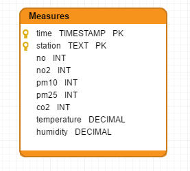

#Rendu du workshop NoSQL

L'idée était de simuler l'acquisition de données issues de capteur de mesure de qualité de l'air.
L'architecture est composée d'un cluster Cassandra, d'un cluster ElasticSearch et d'un Kibana.
Cassandra 3.10, ElasticSearch 5.2.1 et Kibana 5.2.1 ont été utilisés dans le cadre de ce workshop.

##Modélisation des données Cassandra

Le fichier cql/init.cql permet d'initialiser Cassandra avec le keyspace et la table adéquat.
Pour l'exécuter il suffit de taper la commande suivante :
```
  bin/cqlsh -f ../TP/cql/init.cql
```
  

  
##Import des données dans Cassandra
Afin d'importer les données contenu dans les 3 fichiers csv, il suffit de lancer l'exécution de import_cassandra.py de la façon suivante :
```
  python your_path/import_cassandra.py hosts port
```  

##Modélisation des données ElasticSearch
Les données sont divisées en 3 index : un par station. Toutes les données sont cependant du même type : measure
Les index sont crée automatiquement par le driver ElasticSearch Python.
Les colunnes de Cassandra ont été transposés à ElasticSearch avec le même nom sauf pour le champ correspondant au timestamp (time). Dans ElasticSearch, ce champ s'appelle @timestamp afin de respecter la configuration par défaut de logstash et ainsi faciliter la configuration pour TimeLion.
  
##Import des données dans ElasticSearch depuis Cassandra
Afin d'importer les données contenu dans Cassandra, il suffit de lancer l'exécution de import_from_cassandra_to_elastic.py de la façon suivante :
```
  python your_path/import_from_cassandra_to_elastic.py cassandra_host cassandra_port elasticsearch_host elasticsearch_port
```  
  
##Visualisation des données
Des screenshots des visualisations qui ont peut être produites à partir des données. de TimeLion. Il est possible de visualiser la requête écrite pour les visualiations NO2 et PM10. Les autres requêtes sont très similaire
